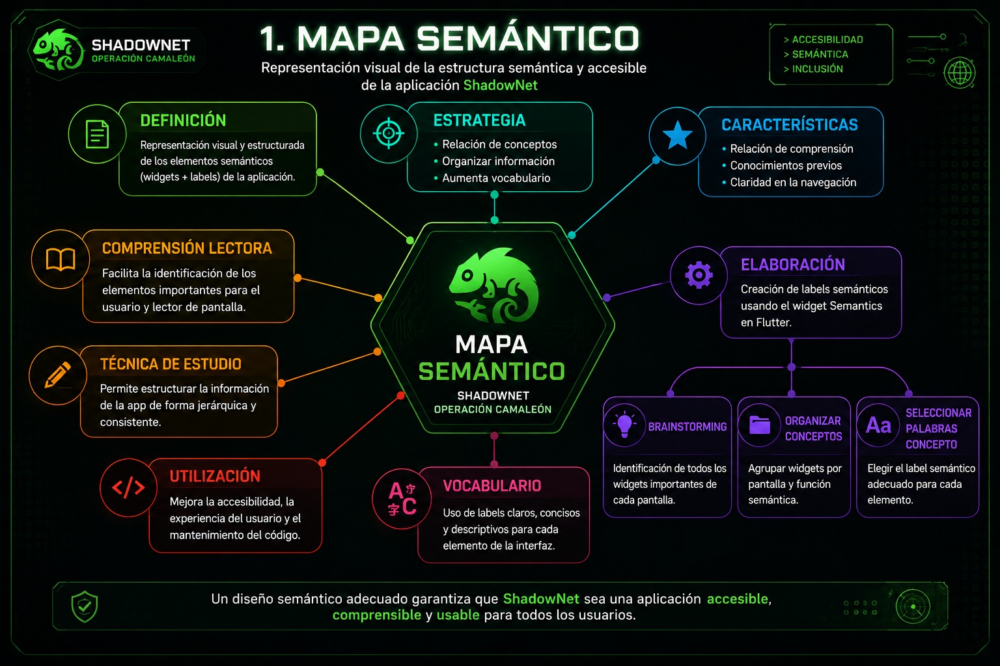

# README.md — Informe Técnico de Accesibilidad
## Proyecto: ShadowNet + Operación Camaleón

---

#  Misión: Auditoría de Accesibilidad ShadowNet

Este informe técnico documenta la auditoría de accesibilidad realizada sobre la aplicación **ShadowNet**, desarrollada en Flutter.

El objetivo fue:

- Implementar widgets accesibles mediante `Semantics`
- Detectar errores de accesibilidad
- Refactorizar el código aplicando principios de Clean Code

---

# 1️⃣ Mapa Semántico




A continuación se listan los principales widgets de la aplicación y su respectivo label de accesibilidad implementado mediante `Semantics`.

| Pantalla | Widget | Label Semántico |
|---|---|---|
| ProfileScreen | AppBar Title | `"Pantalla de perfil del agente"` |
| ProfileScreen | Imagen de facción | `"Imagen: Logo facción Hacker"` |
| ProfileScreen | Botón Hacker | `"Botón: Seleccionar facción Hacker"` |
| ProfileScreen | Botón Enforcer | `"Botón: Seleccionar facción Enforcer"` |
| ProfileScreen | Botón Ghost | `"Botón: Seleccionar facción Ghost"` |
| ProfileScreen | Botón Logout | `"Botón: Finalizar misión y borrar rastro"` |

---

# 2️⃣ Corrección de Errores de Accesibilidad

Durante la auditoría se encontraron múltiples elementos sin soporte adecuado para usuarios con discapacidad visual.

---

##  Error 1 — Imagen sin descripción accesible

### Problema

La imagen del logo de facción no tenía descripción para lectores de pantalla.

### Solución

Se agregó `Semantics`.

```dart
Semantics(
  label: "Imagen: Logo facción ${factionProvider.currentFaction}",
  child: Image.asset(
    factionProvider.currentLogo,
    height: 120,
  ),
)
```

---

##  Error 2 — Botones de facciones sin label

### Problema

Los botones de selección de facción no podían ser identificados correctamente.

### Solución

Se añadió un `label` descriptivo.

```dart
Semantics(
  label: "Botón: Seleccionar facción Hacker",
  button: true,
  child: ElevatedButton(
    onPressed: () {},
    child: Text("Hacker"),
  ),
)
```

---

## Error 3 — Botón de logout sin accesibilidad

### Problema

El botón de cerrar sesión no indicaba su función real.

### Solución

Se agregó descripción semántica.

```dart
Semantics(
  label: "Botón: Finalizar misión y borrar rastro",
  button: true,
  child: ElevatedButton(
    onPressed: () {},
    child: Text("Cerrar Sesión"),
  ),
)
```

---

##  Error 4 — Fondo Matrix con alta intensidad visual

### Problema

El fondo animado podía generar distracción visual excesiva.

### Solución

Se redujo la intensidad visual utilizando opacidades más suaves.

```dart
paint.color = Colors.greenAccent.withOpacity(opacity * 0.6);
```

---

##  Error 5 — Mensajes de autenticación poco claros

### Problema

Los mensajes biométricos no eran suficientemente descriptivos.

### Solución

Se mejoraron los mensajes para facilitar comprensión.

```dart
_statusMessage =
"⚠️ Biometría no disponible en este dispositivo";
```

---

# 3️⃣ Script de Limpieza — Refactorización Clean Code

Se aplicaron principios de Clean Code sobre el proyecto ShadowNet.

---

##  Variables en inglés

### Antes

```dart
String mensaje;
```

### Después

```dart
String statusMessage;
```

---

##  Métodos pequeños y específicos

### Antes

Funciones demasiado largas y difíciles de mantener.

### Después

```dart
authenticate()
_triggerSelfDestruct()
logout()
```

---

## Uso de nombres descriptivos

### Antes

```dart
bool auth;
```

### Después

```dart
bool isAuthenticated;
```

---

##  Manejo organizado de errores

Se implementaron múltiples bloques `catch` específicos.

```dart
on PlatformException catch (e)
```

---

##  Comentarios claros tipo documentación

Se añadieron comentarios descriptivos en métodos importantes.

```dart
// Metodo de autenticacion biometrica
Future<void> authenticate() async
```

---

#  Conclusiones

La auditoría permitió mejorar significativamente la accesibilidad y organización del proyecto ShadowNet.

Se lograron:

- Interfaces compatibles con lectores de pantalla
- Mejor comprensión de botones e imágenes
- Código más limpio y mantenible
- Mejor experiencia para usuarios con discapacidad visual

El proyecto ahora cumple mejores prácticas básicas de accesibilidad y Clean Code en Flutter.

---

#  Integrantes

- Persona 1 — Seguridad y autenticación
- Persona 2 — UI y accesibilidad
- Persona 3 — Geolocalización y nodos
````
